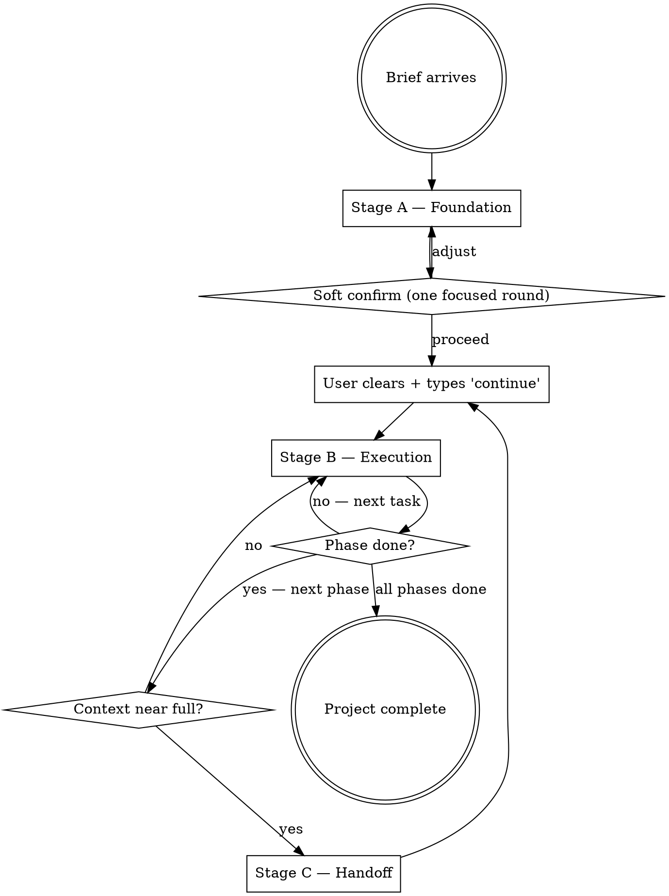

# prompt-to-production

The user gives you a brief. You ship a working software project. End-to-end. Autonomous by default. One soft confirm in the middle. That's the deal.

**Announce at start:** *"I'm using prompt-to-production to turn the brief into a complete software project. Stage A produces planning artifacts; I'll pause once for a focused confirm before Stage B executes the build autonomously."*

## When to use

Activate when:

- The user is starting a new software project and provides a brief — either a markdown file (`./brief.md`, `BRIEF/brief.md`, etc.) or a detailed prompt typed into the session
- The user explicitly asks for an autonomous, phased build from a brief
- The user says "build this," "ship this," "turn this brief into a working app," or refers to `prompt-to-production` by name

Do NOT activate when:

- The user wants to fix a bug, refactor, or make a small change to a finished project — this skill is for greenfield / major-rewrite work
- The user wants to drive every decision interactively — this skill's value is autonomy, not pair-programming
- The user has not provided a brief and cannot articulate what they want built
- The user wants only a plan, not execution — point them to a planning-only skill
- The task is not software — a pitch deck, GTM plan, or research report — use a skill specialized for that output instead

## How sessions work

Every session, your **first action** is to determine which mode you're in:

```
1. Does ./CLAUDE.md exist AND describe a prompt-to-production project?
   → YES: Resume mode. Read CLAUDE.md → read LOG.md last entry → continue Stage B.
   → NO:  Foundation mode. Run Stage A.

2. Is the conversation context above ~85% used? (use /context if available)
   → YES: Run Stage C (context exhaustion handoff). Stop.
```

Claude Code native commands the skill uses are documented in `references/native-claude-code-commands.md`. The skill degrades gracefully when a command isn't available.

There are three stages. SKILL.md routes; the references hold depth.



## Stage A — Foundation (one session)

For the protocol, read `references/stage-a-protocol.md`. The dispatcher view:

1. **Read the brief.** From file (`./brief.md`, `BRIEF/brief.md`, or any path the user names) or from the session prompt. If captured from a prompt, save it as `./brief.md` so future sessions can re-read it.
2. **Validate the brief.** Run `scripts/validate-brief.sh` (or the equivalent inline check from `references/brief-anatomy.md`). Identify gaps to ask about during soft confirm.
3. **Discover skills.** Extract domains from the brief; check `/skills` for what's already installed; produce `SKILLS-TO-INSTALL.md` (Stage 1 / 2 / 3 groupings). See `references/skill-discovery-process.md` for the `find-skills` vs API fallback logic and `rules/trusted-skill-sources.txt` for the trust filter.
4. **Generate the foundation artifacts.** `VISION.md`, `PRODUCT-SPEC.md`, `TECHNICAL-DECISIONS.md` — co-located with the brief (same folder). Use the matching `templates/*.template`. Read `rules/locked-vs-flexible-decisions.md` to interpret the brief's locked vs flexible constraints correctly.
5. **Generate the plan.** `PLAN.md` at repo root. Phases, checklists, definition-of-done per phase, complexity sizing. See `references/phase-design-guide.md`.
6. **Generate the meta files.** `CLAUDE.md` (resume guide for future sessions), empty `LOG.md`, empty `NOTES-TO-ADMIN.md`. All at repo root.
7. **Self-review.** Re-read the artifacts. Fix placeholders, contradictions, missing definitions of done. Surface any genuine blocker into `NOTES-TO-ADMIN.md` as IMPORTANT or BLOCKER.
8. **Soft confirm.** Ask the **opt-in question** first — does the user want the 5 confirmation questions? If yes, ask up to 5 adaptive selectable-option questions covering the highest-leverage decisions for this project. If no, log the assumptions as IMPORTANT in `NOTES-TO-ADMIN.md`. Use `AskUserQuestion` throughout. See `references/stage-a-protocol.md` for the opt-in wording, the question-selection criteria, and the question shapes.
9. **Hand off.** Set the autonomy goal via `/goal` (if available) — see `references/native-claude-code-commands.md`. Then tell the user verbatim: *"Stage A is complete. Install Stage 1 skills from `SKILLS-TO-INSTALL.md`, resolve any preemptive blockers in `NOTES-TO-ADMIN.md`, then run `/clear` and type `continue` — I'll pick up Stage B from `LOG.md`'s last entry."* Stop.

<HARD-GATE>
Stage A's soft confirm is the **only structured interaction** in the skill's lifecycle. After Stage A, you do not ask the user "should I proceed?" between phases. Blockers go to `NOTES-TO-ADMIN.md`; you continue with non-dependent work. See `references/autonomy-contract.md`.
</HARD-GATE>

## Stage B — Execution (one or more sessions)

For the protocol, read `references/log-protocol.md`. The dispatcher view:

1. **Read `CLAUDE.md`.** It orients you to the project's stack, conventions, and where things live.
2. **Read `PLAN.md`.** See all phases and the definition of done for each.
3. **Read the last entry of `LOG.md`.** This is the resume point. If empty, you are at the start of Phase 1.
4. **Read `NOTES-TO-ADMIN.md`.** Any unresolved BLOCKER affecting the current phase pauses dependent work; do non-dependent work where possible.
5. **Check skill readiness for the upcoming phase.** If the phase needs a Stage 2 skill not yet installed: `/skills` → `npx skills add ...` → `/reload-plugins` → continue without `/clear`. See `references/dynamic-skill-installation.md`. Fallback if `/reload-plugins` unavailable: BLOCKER asking the user to `/clear continue`.
6. **Pick up the next concrete task.** Execute it. Test what you build. See `references/phase-design-guide.md` for the per-phase test discipline.
7. **Update `LOG.md`** at start of work, at significant decisions, at end of work. Concise — see `references/log-protocol.md`.
8. **Check `/context` periodically.** At task boundaries within a phase, and before substantial new tasks. If >85%, prepare for Stage C handoff.
9. **At phase completion:** append to `PLAN.md`'s "Phase Completion Log" section, write a LOG entry, **continue to the next phase without asking permission**. The plan is the authority.

<HARD-GATE>
Stage B is fully autonomous. Do not ask "should I move to Phase N?" or "ready to deploy?" If a decision is genuinely irreversible or requires an external action (API key, account creation, irrevocable infrastructure choice), write a BLOCKER to `NOTES-TO-ADMIN.md` and continue with non-dependent work. See `references/notes-to-admin-guide.md` for severity rules.
</HARD-GATE>

## Stage C — Context exhaustion (mid-session)

When `/context` shows ~85–90% utilization (or you sense it coming):

1. **Stop at the nearest safe point** — a finished task, a passing test, a clean commit. Don't stop mid-edit.
2. **Write a detailed `LOG.md` entry** capturing: current phase, last completed task, next concrete task, in-flight state, open questions. Future-you reads this.
3. **Choose `/compact` vs `/clear`:** mid-phase (in-flight state matters) → recommend `/compact`. Phase boundary (LOG.md already carries everything) → recommend `/clear`. Tell the user verbatim, picking the one that fits: *"Context is near full. Run `/compact` (or `/clear`) and type `continue`. I will resume from the last `LOG.md` entry."*
4. **Stop.** Do not start new work.

See `references/context-exhaustion-protocol.md` for what makes a good handoff entry and `references/native-claude-code-commands.md` for the `/context`, `/compact`, `/clear` semantics.

## The autonomy contract (12 rules — summary)

Full text and rationale in `references/autonomy-contract.md`. The titles only:

1. **Brief is the contract.** What the brief specifies is what gets built.
2. **Stage A soft confirm asks selectable questions only.** No essay-length confirmation prompts.
3. **Stage B is fully autonomous.** No per-phase permission prompts.
4. **`LOG.md`'s last entry is the resume point.** Every new session reads it.
5. **`NOTES-TO-ADMIN.md` is for the genuinely critical.** Severity: BLOCKER / IMPORTANT / FYI.
6. **Locked constraints in `TECHNICAL-DECISIONS.md` are not up for revision** during execution.
7. **Test as you go.** Every phase ends with verification of what was built.
8. **Skill stage transition.** Before a phase depending on Stage 2/3 skills, if not installed → BLOCKER.
9. **Cost-aware development.** Cached fixtures and stubs during testing; real API integration verified once per phase.
10. **No silent skipping.** Blocked task = `NOTES-TO-ADMIN.md` entry + flag in `PLAN.md`.
11. **Commit hygiene.** Meaningful milestones, tied to phase + task. Never commit secrets.
12. **Logs are diffs, not novels.** A paragraph or short bullet list per work block.

## File map (what this skill produces)

Co-located with the brief (same folder):
- `VISION.md` — the why
- `PRODUCT-SPEC.md` — the what
- `TECHNICAL-DECISIONS.md` — the how, with locked vs flexible flags

At repo root:
- `CLAUDE.md` — resume guide; the entry point for every future session
- `PLAN.md` — phases + definition of done
- `LOG.md` — append-only narrative; last entry is the resume point
- `NOTES-TO-ADMIN.md` — BLOCKER / IMPORTANT / FYI entries for the user
- `SKILLS-TO-INSTALL.md` — Stage 1 / 2 / 3 skill recommendations with install commands

## Reference index

Open these on demand:

**Workflow protocols**
- `references/stage-a-protocol.md` — full Stage A protocol, opt-in soft confirm, adaptive 5-question selection, self-review checklist
- `references/log-protocol.md` — `LOG.md` entry format, resume mechanics, the difference between a log entry and an admin note
- `references/phase-design-guide.md` — how to size phases, definition-of-done patterns, per-phase testing discipline
- `references/notes-to-admin-guide.md` — severity rules, when to surface, entry format, examples
- `references/context-exhaustion-protocol.md` — `/context` polling, `/compact` vs `/clear` choice, what makes a good handoff entry
- `references/autonomy-contract.md` — the 12 rules, in full, with rationale and worked examples

**Skill discovery**
- `references/skill-discovery-process.md` — domain extraction, `find-skills` vs API fallback, audit filter, dynamic install pointer
- `references/dynamic-skill-installation.md` — Stage B install via `/skills` + `npx skills add` + `/reload-plugins`; fallback if `/reload-plugins` unavailable
- `references/stage-mapping-heuristics.md` — when does a recommended skill belong to Stage 1 vs 2 vs 3?

**Brief and platform**
- `references/brief-anatomy.md` — what a good brief contains, gap-filling patterns when the brief is thin
- `references/native-claude-code-commands.md` — every native Claude Code command the skill uses, when, and the fallback for each

**Audit and contracts**
- `references/security-posture.md` — what the skill does and does not do at the system level; the contract with auditors

**Deferred (v0.3) design notes**
- `references/sub-agent-design-deferred.md` — planned `agents/` folder for v0.3; how the implementer / reviewer trio will integrate
- `references/lifecycle-hooks-deferred.md` — planned `hooks/` folder for v0.3; SessionStart / UserPromptSubmit / PostToolUse designs

Lookup tables in `rules/`:

- `rules/trusted-skill-sources.txt` — trust list for skill discovery (overridable by `BRIEF/trusted-sources.txt`)
- `rules/locked-vs-flexible-decisions.md` — how to read the brief's constraint vocabulary

Runtime templates in `templates/`:

- One `*.template` per generated artifact, with `{{PLACEHOLDER}}` syntax

Helpers in `scripts/`:

- `scripts/validate-brief.sh` — sanity-check a brief input

## Cousin skills (for context, not dependencies)

`prompt-to-production` deliberately absorbs the work that these otherwise-chained skills do, so it can run autonomously end-to-end:

- `brainstorming` — Stage A subsumes this; the soft confirm is the analog of the design-approval gate
- `writing-plans` — Stage A produces `PLAN.md` directly
- `executing-plans` — Stage B is the autonomous execution loop
- `verification-before-completion` — applied per-phase via the test discipline; never claim a phase done without running the verification command
- `find-skills` — used during Stage A if installed; API fallback otherwise

If the user already follows a `brainstorming → writing-plans → executing-plans` workflow and wants checkpoints between every phase, this is not the right skill — point them at that chain.
